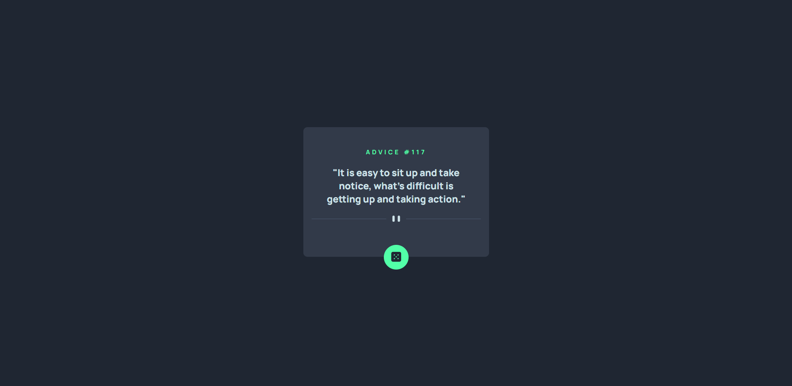

# Frontend Mentor - Solução para aplicativo gerador de conselhos

Esta é uma solução para o [Advice generator app challenge on Frontend Mentor](https://www.frontendmentor.io/challenges/advice-generator-app-QdUG-13db). Os desafios do Frontend Mentor ajudam você a aprimorar suas habilidades de programação por meio da criação de projetos realistas.

## Índice

- [Visão-geral](#visão-geral)
  - [O desafio](#o-desafio)
  - [Tela](#Tela)
  - [Links](#links)
- [Meu processo](#meu-processo)
  - [Construído com](#construído-com)
  - [O que eu aprendi](#o-que-eu-aprendi)
  - [Autor](#autor)

## Visão geral

### O desafio

Os usuários devem ser capazes de:

- Visualizar o layout ideal para o aplicativo, dependendo do tamanho da tela do seu dispositivo
- Ver os estados de foco para todos os elementos interativos na página
- Gerar uma nova dica clicando no ícone de dado

### Tela

### Links
- URL do site ativo: [Adicionar URL do site ativo aqui](https://your-live-site-url.com)

## Meu processo

### Construído com

- HTML
- CSS
- Flexbox

### O que aprendi
No meu projeto, aprendi a usar o Flexbox para organizar melhor os elementos na tela. Conseguir alinhar as coisas no centro, colocar um do lado da outra e deixar tudo mais responsivo, funcionando bem em diferentes tamanhos de tela. Facilitou muito montar o layout do jeito que eu queria

## Autor

- Github - [@kauannkelvinn](https://github.com/kauannkelvinn)
- Mentor de Frontend - [@kauannkelvinn](https://www.frontendmentor.io/profile/kauannkelvinn)